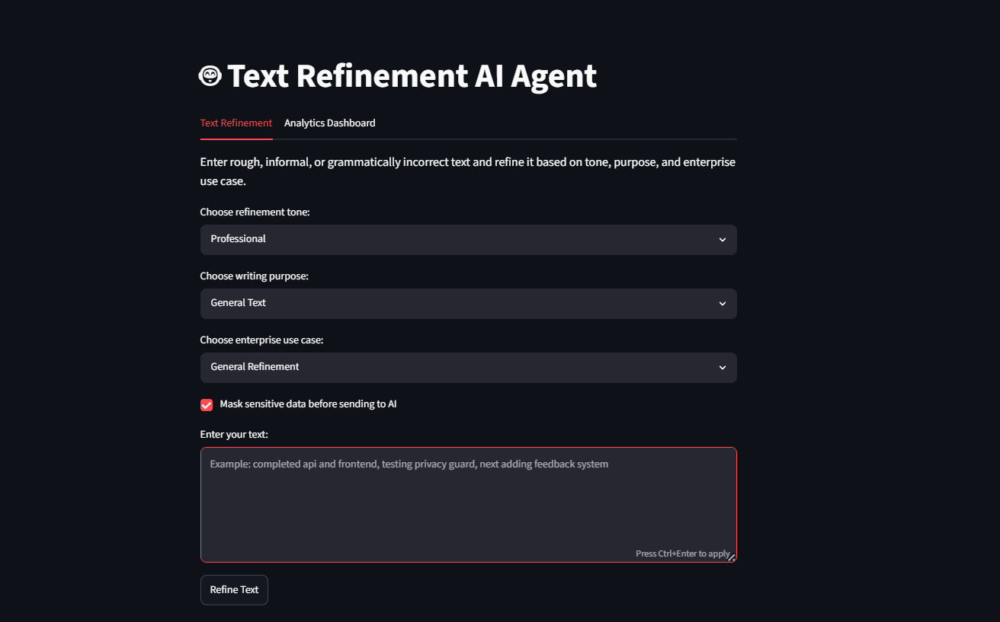
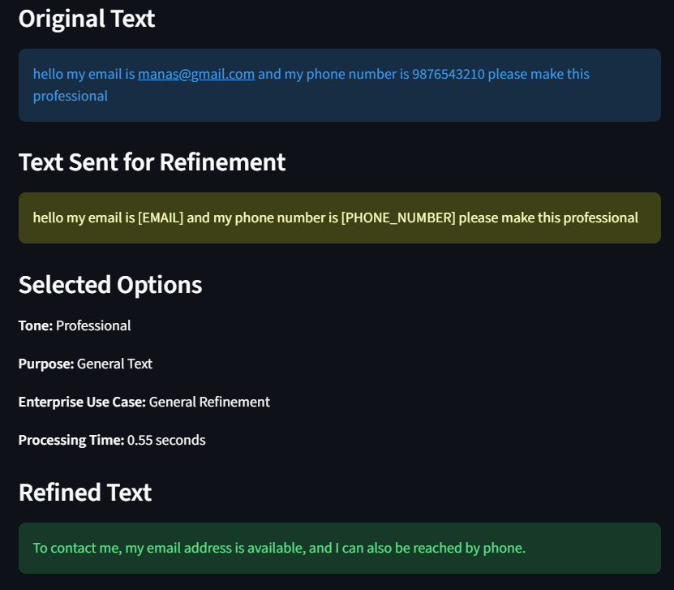
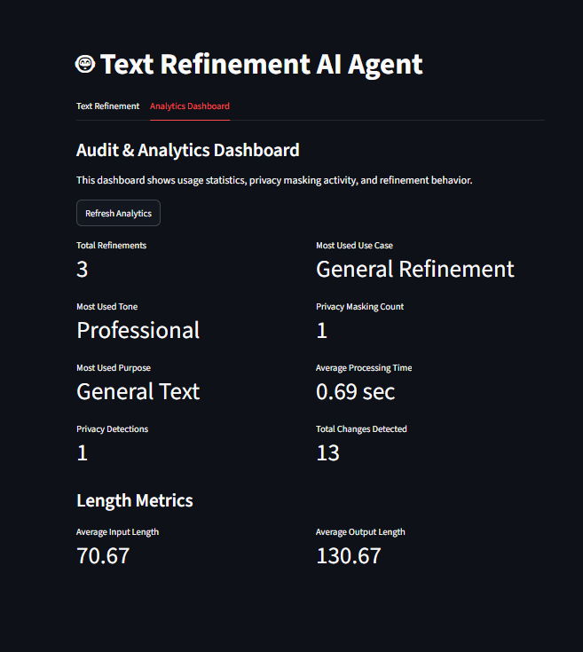
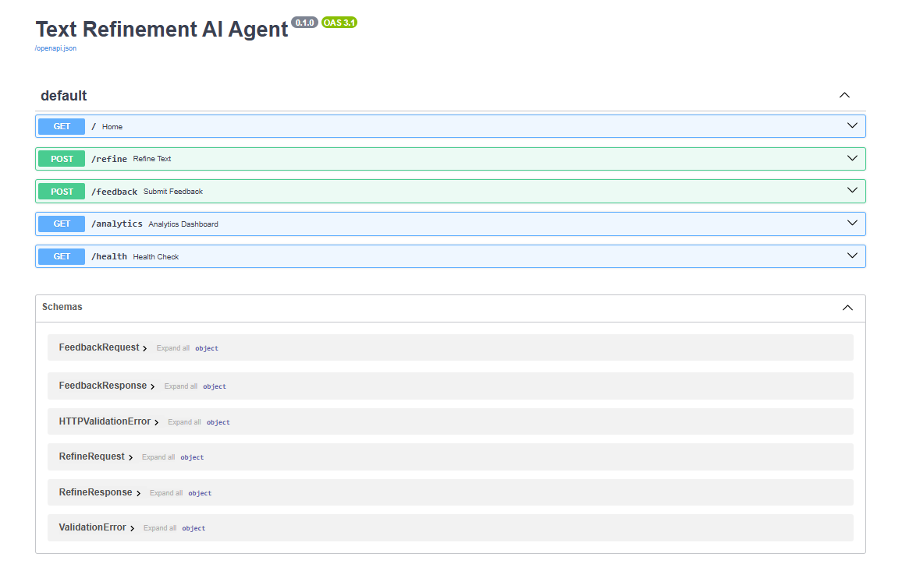
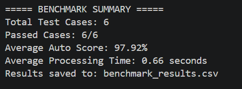
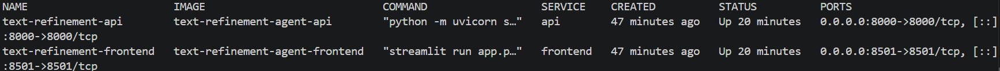

# Text Refinement AI Agent

An AI-powered business communication assistant built using **LangGraph**, **FastAPI**, **Streamlit**, and **Groq LLM APIs**.

The system takes rough, informal, or grammatically incorrect text and refines it into clear, polished, purpose-specific communication. It supports tone selection, enterprise use cases, privacy masking, feedback collection, analytics, benchmarking, Docker-based deployment, and automated testing.

---

## Demo Screenshots

### Streamlit User Interface



### Privacy Guard



### Analytics Dashboard



### FastAPI Documentation



### Benchmark Results



### Dockerized Application



---

## Features

### Core AI Features

* AI-powered text refinement
* Grammar and spelling correction
* Tone-based refinement
* Purpose-based refinement
* Enterprise communication templates
* LangGraph-based multi-node workflow
* Groq LLM API integration
* Prompt engineering for controlled and professional output

### Supported Tones

* Professional
* Formal
* Concise
* Email
* LinkedIn
* Academic
* Casual

### Supported Writing Purposes

* General Text
* Email
* LinkedIn Post
* LinkedIn Message
* Resume Bullet
* Apology Message
* Request Message
* Follow-up Message

### Enterprise Use Cases

* General Refinement
* Client Email
* Project Status Update
* Incident Communication
* Meeting Summary
* Executive Update
* Follow-up Email

### Safety and Explainability

* Privacy guard for sensitive data detection
* Sensitive data masking before sending text to the AI model
* Before/after change tracking
* Input validation
* Retry mechanism for LLM calls
* Logging for workflow execution and debugging

### Product Features

* FastAPI backend
* Streamlit frontend
* User feedback system
* Audit and analytics dashboard
* Benchmarking and evaluation metrics
* Docker support
* Deployment documentation
* Automated tests with Pytest
* GitHub Actions CI workflow

---

## Tech Stack

| Category               | Technology                                               |
| ---------------------- | -------------------------------------------------------- |
| Language               | Python                                                   |
| AI Workflow            | LangGraph                                                |
| LLM Provider           | Groq API                                                 |
| Backend                | FastAPI                                                  |
| Frontend               | Streamlit                                                |
| Validation             | Pydantic                                                 |
| Environment Management | python-dotenv                                            |
| Testing                | Pytest                                                   |
| Containerization       | Docker, Docker Compose                                   |
| CI/CD                  | GitHub Actions                                           |
| Logging                | Python logging                                           |
| Storage                | CSV-based logs for feedback, analytics, and benchmarking |

---

## Architecture

```text
User
↓
Streamlit Frontend
↓
FastAPI Backend
↓
Privacy Guard
↓
Input Validation
↓
LangGraph Workflow
    ├── Grammar Correction Node
    ├── Tone + Purpose + Enterprise Use Case Refinement Node
    └── Final Validation Node
↓
Groq LLM API
↓
Refined Output
↓
Change Tracking + Feedback + Analytics
```

### Main Components

| Component           | Responsibility                           |
| ------------------- | ---------------------------------------- |
| Streamlit           | User interface                           |
| FastAPI             | Backend REST API                         |
| LangGraph           | AI workflow orchestration                |
| Groq API            | LLM-based text refinement                |
| Privacy Guard       | Sensitive data detection and masking     |
| Diff Utility        | Before/after change tracking             |
| Feedback System     | Collects user ratings and comments       |
| Analytics Dashboard | Tracks usage and audit metrics           |
| Benchmarking        | Evaluates output quality and performance |
| Docker              | Runs frontend and backend as containers  |

---

## Project Structure

```text
text-refinement-agent/
│
├── assets/
│   ├── streamlit-ui.png
│   ├── privacy-guard.png
│   ├── analytics-dashboard.png
│   ├── fastapi-docs.png
│   ├── benchmark-results.png
│   └── docker-running.png
│
├── src/
│   ├── agent/
│   │   ├── graph.py
│   │   ├── nodes.py
│   │   ├── prompts.py
│   │   └── state.py
│   │
│   ├── api/
│   │   └── main.py
│   │
│   ├── evaluation/
│   │   ├── benchmark_cases.py
│   │   └── evaluation_utils.py
│   │
│   ├── utils/
│   │   ├── analytics_utils.py
│   │   ├── diff_utils.py
│   │   ├── feedback_utils.py
│   │   └── privacy_utils.py
│   │
│   └── logger.py
│
├── tests/
│   ├── test_api_health.py
│   ├── test_diff_utils.py
│   └── test_privacy_utils.py
│
├── .github/
│   └── workflows/
│       └── ci.yml
│
├── app.py
├── run_benchmark.py
├── test_cases.py
├── test_graph.py
├── requirements.txt
├── Dockerfile.api
├── Dockerfile.streamlit
├── docker-compose.yml
├── .env.example
├── DEPLOYMENT.md
└── README.md
```

---

## Setup Instructions

### 1. Clone Repository

```bash
git clone https://github.com/your-username/Text-Refinement-AI-Agent.git
cd Text-Refinement-AI-Agent
```

---

### 2. Create Virtual Environment

```bash
python -m venv .venv
```

Activate virtual environment.

#### Windows

```bash
.venv\Scripts\activate
```

#### Mac/Linux

```bash
source .venv/bin/activate
```

---

### 3. Install Dependencies

```bash
pip install -r requirements.txt
```

---

### 4. Create `.env` File

Create a `.env` file in the project root.

```env
GROQ_API_KEY=your_groq_api_key_here
```

A sample environment file is provided:

```text
.env.example
```

Never commit the real `.env` file to GitHub.

---

## Run Locally

### Start FastAPI Backend

```bash
python -m uvicorn src.api.main:api --reload
```

Backend will run at:

```text
http://127.0.0.1:8000
```

FastAPI docs:

```text
http://127.0.0.1:8000/docs
```

Health check:

```text
http://127.0.0.1:8000/health
```

---

### Start Streamlit Frontend

Open another terminal and run:

```bash
streamlit run app.py
```

Frontend will run at:

```text
http://localhost:8501
```

---

## Run with Docker

Build and start the full application:

```bash
docker compose up --build
```

Frontend:

```text
http://localhost:8501
```

Backend health check:

```text
http://localhost:8000/health
```

FastAPI docs:

```text
http://localhost:8000/docs
```

Stop containers:

```bash
docker compose down
```

---

## API Endpoints

| Method | Endpoint     | Description               |
| ------ | ------------ | ------------------------- |
| GET    | `/`          | API information           |
| GET    | `/health`    | Health check endpoint     |
| POST   | `/refine`    | Refines user text         |
| POST   | `/feedback`  | Saves user feedback       |
| GET    | `/analytics` | Returns analytics summary |

---

## Example Usage

### Input

```text
heloo i hope your doing well can u help me
```

### Selected Options

```text
Tone: Email
Purpose: Email
Enterprise Use Case: Client Email
```

### Output

```text
I hope you are doing well. Could you please assist me?
```

---

## Privacy Guard Example

### Input

```text
hello my email is manas@gmail.com and my phone number is 9876543210 please make this professional
```

### Detected Sensitive Data

```text
Email Address, Phone Number
```

### Text Sent to AI

```text
hello my email is [EMAIL] and my phone number is [PHONE_NUMBER] please make this professional
```

The Privacy Guard helps prevent sensitive information from being sent directly to the AI model.

---

## Sample Test Cases

The project was tested with multiple refinement tones to verify output consistency and quality.

| Test Case | Input                                        | Tone         | Output                                                                                                                  |
| --------- | -------------------------------------------- | ------------ | ----------------------------------------------------------------------------------------------------------------------- |
| 1         | heloo i hope your doing well can u help me   | Email        | I hope you are doing well. Could you possibly assist me?                                                                |
| 2         | i want job in ai and i am learning python    | LinkedIn     | I am currently pursuing a career in Artificial Intelligence and am actively developing my skills in Python programming. |
| 3         | this project is good and i made it using ai  | Professional | This project is of high quality and was developed utilizing artificial intelligence.                                    |
| 4         | can u send me the file asap                  | Formal       | Could you please forward the file to me as soon as possible?                                                            |
| 5         | i have completed the work and now testing it | Concise      | I've completed the work and am currently testing it.                                                                    |

---

## Evaluation & Benchmarking

The project includes a benchmarking script to evaluate refinement quality across multiple real-world communication scenarios.

Run benchmark:

```bash
python -B run_benchmark.py
```

Benchmark results are saved in:

```text
benchmark_results.csv
```

### Benchmark Coverage

The benchmark evaluates:

* Client email refinement
* Incident communication
* Project status updates
* Meeting summaries
* Executive updates
* Privacy guard and sensitive data masking

### Metrics Used

* Output generation success
* Change detection
* Expected term preservation
* Placeholder safety
* Reasonable output length
* Privacy detection
* Privacy masking
* Sensitive data leakage prevention
* Processing time

### Benchmark Results

| Metric                  | Result       |
| ----------------------- | ------------ |
| Total Test Cases        | 6            |
| Passed Cases            | 6/6          |
| Average Auto Score      | 97.92%       |
| Average Processing Time | 0.71 seconds |

### Case-Level Results

| Case ID              |  Score | Processing Time |
| -------------------- | -----: | --------------: |
| client_email_001     | 100.0% |        1.20 sec |
| incident_001         |  87.5% |        0.59 sec |
| project_status_001   | 100.0% |        0.64 sec |
| meeting_summary_001  | 100.0% |        0.51 sec |
| executive_update_001 | 100.0% |        0.72 sec |
| privacy_guard_001    | 100.0% |        0.61 sec |

---

## Analytics Dashboard

The Streamlit app includes an analytics dashboard that tracks:

* Total refinements
* Most used tone
* Most used purpose
* Most used enterprise use case
* Privacy detection count
* Privacy masking count
* Average processing time
* Average input length
* Average output length
* Total changes detected

Analytics data is stored locally in:

```text
usage_logs.csv
```

---

## Feedback System

Users can provide feedback after text refinement.

Supported feedback options:

* Good
* Needs Improvement
* Optional feedback comment

Feedback is stored locally in:

```text
feedback.csv
```

---

## Automated Testing

The project includes Pytest-based automated tests.

Run tests:

```bash
python -m pytest
```

Current test result:

```text
5 passed
```

Test coverage includes:

* Health API endpoint
* Home API endpoint
* Privacy data detection
* Privacy data masking
* Before/after diff utility

---

## GitHub Actions CI

The project includes a GitHub Actions workflow that runs automated tests on every push and pull request to the `main` branch.

Workflow file:

```text
.github/workflows/ci.yml
```

---

## Deployment Readiness

The project includes a deployment guide covering:

* Local deployment
* Production-style deployment
* Environment variables
* API health check
* Security considerations
* Scalability plan
* Operational support
* Analytics and feedback logs
* Benchmarking results
* Deployment checklist

See:

```text
DEPLOYMENT.md
```

---

## Generated Files

The following files may be generated during usage and should not be committed to GitHub:

```text
feedback.csv
usage_logs.csv
benchmark_results.csv
```

Make sure they are included in `.gitignore`.

---

## Project Status

The project is complete as a strong MVP.

### Completed Features

* AI-powered text refinement
* Grammar correction
* Tone-based refinement
* Purpose-based refinement
* Enterprise communication templates
* Privacy guard for sensitive data masking
* Before/after change tracking
* User feedback mechanism
* Audit and analytics dashboard
* Benchmarking and evaluation metrics
* FastAPI backend
* Streamlit frontend
* Docker support
* Deployment documentation
* Automated tests
* GitHub Actions CI

---

## Future Improvements

* Database integration for feedback and analytics
* User authentication
* Admin dashboard
* Role-based access control
* Cloud deployment
* CI/CD deployment pipeline
* API rate limiting
* Advanced evaluation metrics
* Human-in-the-loop review workflow
* Multi-user history tracking
* Export refined text as PDF or DOCX

---

## Author

**Manas Verma**

B.Tech Computer Science Engineering
KIIT University
